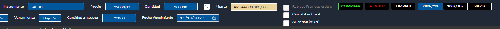
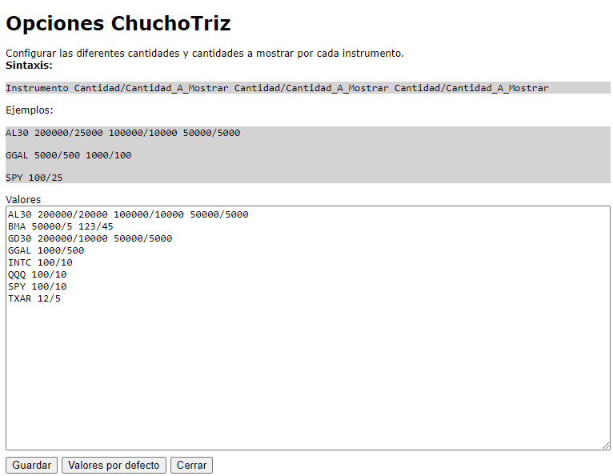

# ChuchoTriz - Extension de Chrome para Matriz

ChuchoTriz es una extensión de Chrome para Matriz que agrega funcionalidad para permitir operar de forma más ágil.

## Features

### Presets de Cantidad/Cantidad a mostrar por Instrumento

Permite tener predefinidos diferentes cantidades y cantidades a mostrar por instrumento. Haciendo click en los botones, completa automáticamente la Cantidad y  
Cantidad a mostrar en el panel inferior.



### Configurar Presets por Instrumento

En las opciones de la extensión de Chrome se pueden definir los diferentes instrumentos y las cantidades/cantidades a mostrar deseadas.



## Setup

### Instalar dependencias

```sh
npm install
```

### Build extension

```
npm run build
```

### Load extension

1. Navigate to [chrome://extensions/](chrome://extensions/)
1. Turn on the "Developer mode" toggle switch in the top right of the window
1. Click the "Load unpacked" button in top left of the window
1. Select the `dist` directory to load the extension
1. Navigate to https://matriz.cocos.xoms.com.ar/ to see the Content Script React app
1. Go to extensions and click "React TypeScript Chrome Extension" to see the Popup React app
