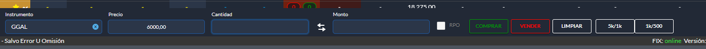
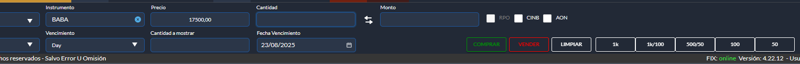
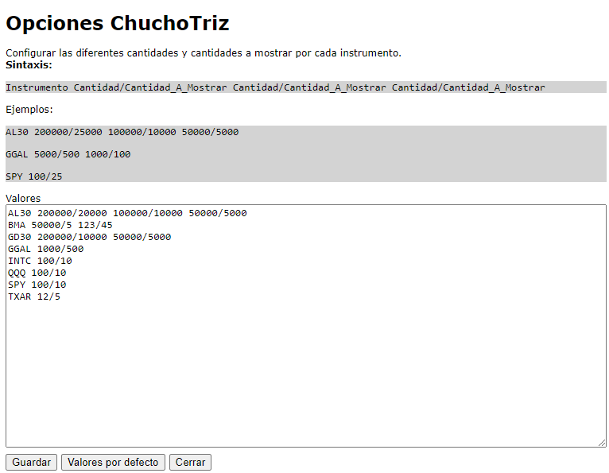

# ChuchoTriz - Extensión de Chrome para Matriz

ChuchoTriz es una extensión de Chrome para Matriz que agrega funcionalidad para permitir operar de forma más ágil y eficiente en el trading.

## Instalación de la Extensión

1. Ir a la sección [Releases](https://github.com/ChuchoCoder/chuchotriz/releases)
2. Descargar el archivo zip más reciente (Ejemplo: [2025-08-23.zip](https://github.com/ChuchoCoder/ChuchoTriz/releases/download/2025-08-23/2025-08-23.zip))
3. Descomprimir el archivo zip en una carpeta local (Ejemplo: `chuchotriz`)
4. Abrir Chrome y navegar a [chrome://extensions/](chrome://extensions/)
5. Activar el "Modo de desarrollador" en la parte superior derecha de la ventana
6. Hacer clic en el botón "Cargar extensión sin empaquetar" en la parte superior izquierda
7. Seleccionar el directorio donde se descomprimió la extensión para cargarla
8. Navegar a la plataforma Matriz de su broker (Ejemplo: <https://matriz.cocos.xoms.com.ar/>) e iniciar sesión
9. Seleccionar un instrumento o hacer clic en el precio para ver los botones de presets automáticamente
10. Acceder a las opciones de la extensión desde el ícono de la extensión en la barra de herramientas de Chrome

## Funcionalidades Principales

### 1. Presets de Cantidad y Cantidad a Mostrar por Instrumento

La extensión permite configurar presets personalizados de cantidades para cada instrumento, facilitando el trading rápido con valores predefinidos.

**Características:**

- Botones dinámicos que aparecen automáticamente al seleccionar un instrumento
- Formato inteligente de números (muestra "k" para miles y "m" para millones)
- Configuración personalizable por cada ticker/instrumento
- Un clic completa automáticamente tanto la `Cantidad` como la `Cantidad a mostrar`





### 2. Autocompletado Inteligente

El sistema de autocompletado funciona con lógica para optimizar la velocidad de trading:

**Orden de prioridad:**

1. **Último preset utilizado**: Si ya se usó un preset para ese instrumento, utiliza ese valor automáticamente
2. **Primer preset configurado**: Si no hay historial, usa el primer preset definido para el instrumento
3. **Valores por defecto**: Si no hay presets específicos, usa valores predeterminados genéricos

**Activación automática:**

- Al hacer clic en un instrumento
- Al hacer clic en el campo de precio
- Al hacer clic en el campo de cantidad
- Se limpia automáticamente al presionar el botón "Limpiar"

> **Nota**: Esta funcionalidad puede deshabilitarse completamente desde las opciones de la extensión

### 3. Búsqueda Inteligente de Instrumentos

La extensión incluye un algoritmo de búsqueda que permite:

- **Coincidencia exacta**: Busca primero el ticker exacto
- **Coincidencia por prefijo**: Si el instrumento empieza con un ticker configurado
- **Coincidencia parcial**: Si un ticker configurado empieza con el instrumento buscado
- **Fallback a defaults**: Valores por defecto si no encuentra coincidencias

### 4. Configuración Avanzada de Presets

Panel de opciones completo para personalizar la experiencia:

**Sintaxis de configuración:**

```text
Instrumento Cantidad/Cantidad_A_Mostrar Cantidad ...
```

**Ejemplos prácticos:**

```text
AL30 200000/25000 100000/10000 50000
DLR 5000/500 1000/100 100 50
GFG 100/25 50 20
PESOS 100000000 10000000 1000000 100000
```

**Características del panel de opciones:**

- Editor de texto con sintaxis simple
- Checkbox para habilitar/deshabilitar autocompletado
- Botón "Valores por defecto" para restaurar configuración inicial
- Validación de sintaxis con manejo de errores
- Guardado automático en Chrome Storage



### 5. Presets por Defecto Incluidos

La extensión viene con presets preconfigurados para instrumentos populares:

- **AL30, GD30**: Bonos del tesoro con cantidades típicas
- **GGAL, YPFD**: Acciones argentinas
- **SPY, QQQ**: ETFs internacionales  
- **DLR, GFG**: Futuros de dólar y opciones call/put
- **PESOS**: Cauciones

### 6. Panel de Herramientas de Ratios (En Desarrollo)

La extensión incluye la base para un panel lateral de análisis con:

- Filtros por instrumento
- Categorización por tipo (Bonos, Dólar, etc.)
- Interface expandible para futuras funcionalidades de análisis

## Características Técnicas

### Tecnología

- **Frontend**: React 18 con TypeScript
- **Build System**: Vite con plugins específicos para Chrome Extensions
- **Almacenamiento**: Chrome Storage API para persistencia de configuraciones
- **Arquitectura**: Content Script que se inyecta en la página de Matriz

### Compatibilidad

- **Chrome**: Manifest V3
- **Plataforma**: Funciona específicamente con plataformas Matriz (*.xoms.com.ar)
- **Responsive**: Se adapta al diseño existente de Matriz sin interferir

### Rendimiento

- **Carga diferida**: Los elementos se crean solo cuando son necesarios
- **Optimización de DOM**: Uso de selectores específicos para evitar conflictos
- **Eficiencia de memoria**: Limpieza automática de event listeners

## Configuración para Desarrollo

### Instalar dependencias

```sh
npm install
```

### Compilar extensión

```sh
npm run build
```

### Cargar extensión en modo desarrollo

1. Navegar a [chrome://extensions/](chrome://extensions/)
2. Activar el interruptor "Modo de desarrollador" en la parte superior derecha de la ventana
3. Hacer clic en el botón "Cargar extensión sin empaquetar" en la parte superior izquierda
4. Seleccionar el directorio `dist` para cargar la extensión
5. Navegar a <https://matriz.cocos.xoms.com.ar/> para ver la aplicación React del Content Script
6. Ir a extensiones y hacer clic en "React TypeScript Chrome Extension" para ver la aplicación React del Popup
