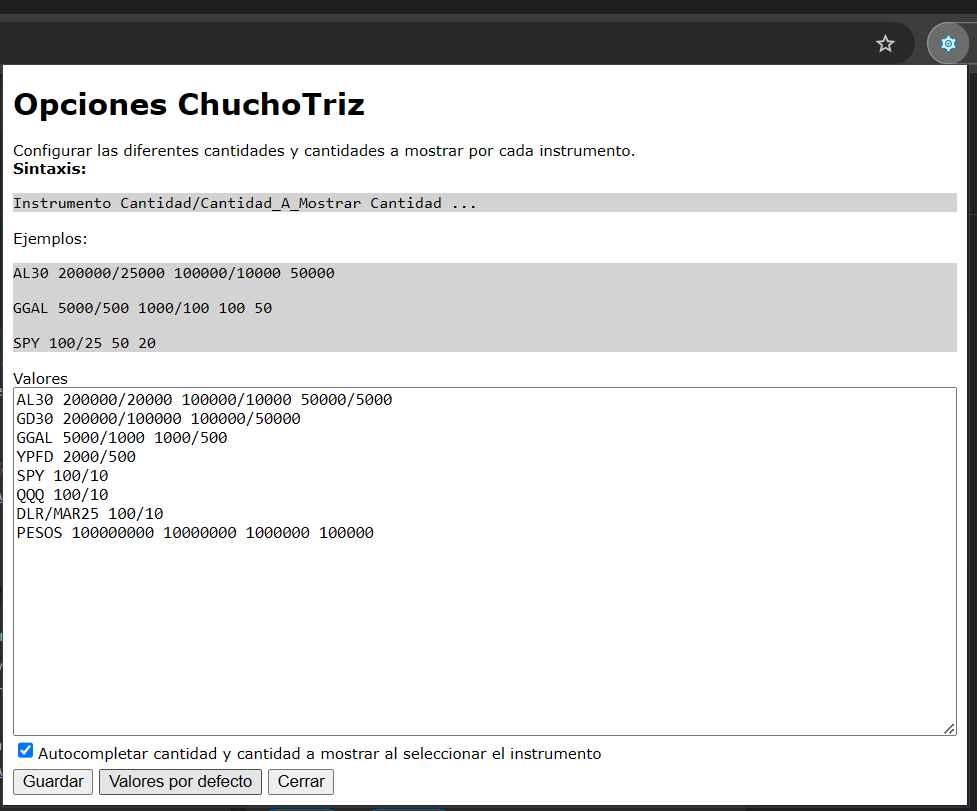

# ChuchoTriz - Extension de Chrome para Matriz

ChuchoTriz es una extensión de Chrome para Matriz que agrega funcionalidad para permitir operar de forma más ágil.

## Agregar extension a Chrome

1. Ir a la sección [Releases](https://github.com/ChuchoCoder/chuchotriz/releases)
2. Descargar el archivo zip (Ejemplo: [2024-10-23.zip](https://github.com/ChuchoCoder/ChuchoTriz/releases/download/2024-10-23/2024-10-23.zip))
3. Descomprimir zip en una carpeta (Ejemplo: `chuchotriz`)
4. Ir a [chrome://extensiones/](chrome://extensiones/)
5. Activar "Modo de desarrollador" en la parte superior derecha de la ventana.
6. Haga clic en el botón "Cargar extensión sin empaquetar" en la parte superior izquierda de la ventana.
7. Seleccionar el directorio donde se descomprimió la extensión (Ejemplo: `chuchotriz`) para cargar la extensión.
8. Navegar a Matriz de su broker (Ejemplo: https://matriz.cocos.xoms.com.ar/) y hacer Login.
9. Seleccionar un instrumento o hacer click en el precio para ver que se agreguen los botones de Cantidad/Cantidad a Mostrar.
10. En la parte superior de Chrome es posible acceder a las opciones de la extensión.

## Funcionalidades

### Presets de Cantidad y Cantidad a mostrar por Instrumento

Permite tener predefinidos diferentes cantidades y cantidades a mostrar por instrumento. Haciendo click en los botones, completa automáticamente la `Cantidad` y  
`Cantidad a mostrar` en el panel inferior.


### Autocompletado de Cantidad y Cantidad a mostrar

Al hacer click en un instrumento o precio, la la `Cantidad` y `Cantidad a mostrar` se completan automáticamente según el siguiente criterio:

1. Con el último Preset utilizado del instrumento seleccionado. Es decir, una vez que se haga click en cualquier de los botones de `Cantidad/Cantidad_A_Mostrar` estos valores se completarán automáticamente.
2. Si no se hizo click en los botones de `Cantidad/Cantidad_A_Mostrar`, se utilizará el primer preset del instrumento seleccionado

> Nota: Esta functionalidad puede deshabilitarse desde las opciones

### Configurar Presets por Instrumento

En las opciones de la extensión de Chrome se pueden definir los diferentes instrumentos y las cantidades/cantidades a mostrar deseadas.



## Development Setup

### Install dependencies

```sh
npm install
```

### Build extension

```sh
npm run build
```

### Load extension

1. Navigate to [chrome://extensions/](chrome://extensions/)
1. Turn on the "Developer mode" toggle switch in the top right of the window
1. Click the "Load unpacked" button in top left of the window
1. Select the `dist` directory to load the extension
1. Navigate to https://matriz.cocos.xoms.com.ar/ to see the Content Script React app
1. Go to extensions and click "React TypeScript Chrome Extension" to see the Popup React app
